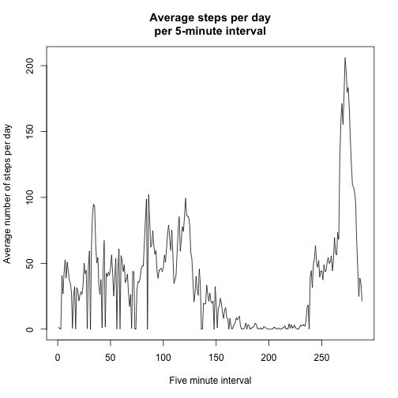
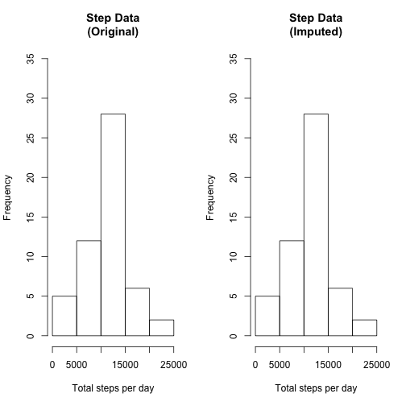
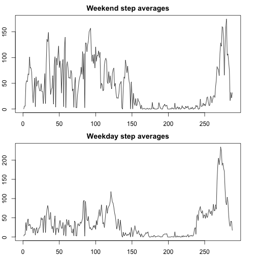

## Loading and preprocessing the data

Load data corresponding to data from a device that collects data at 5 minute intervals through out the day. The data consists of two months of data from an anonymous individual collected during the months of October and November, 2012 and include the number of steps taken in 5 minute intervals each day.

This script assumes that the data file, "activity.csv" is present and unzipped in the same directory as the script. Prior to executing the code, the user should set the working directory to the correct directory.


```r
# Load libraries used in the script
library(plyr)

# Read in the data file, specifying steps as a number, date as a factor, and interval as a factor
data <- read.csv("activity.csv", header=T, colClasses = c("numeric", "factor", "factor"))
```

```
## Warning in file(file, "rt"): cannot open file 'activity.csv': No such file
## or directory
```

```
## Error in file(file, "rt"): cannot open the connection
```

## What is mean total number of steps taken per day?

Calculate the mean and median number of steps taken per day by summarizing the data using dplyr


```r
# Use plyr summarise function to sum the number of steps taken on each day
daySteps <- ddply(data, c("date"), summarise, stepsPerDay = sum(steps))

# Calculate the average steps per day, removing NAs
meanStepsPerDay <- mean(daySteps$stepsPerDay, na.rm=T)
medianStepsPerDay <- median(daySteps$stepsPerDay, na.rm=T)

# Echo the results to the screen
meanStepsPerDay
```

```
## [1] 10766.19
```

```r
medianStepsPerDay
```

```
## [1] 10765
```

## What is the average daily activity pattern?

Calculate and display the average steps for any given 5 minute interval using a line graph


```r
# Create a new dataframe that contains the mean steps per day for each interval
intervalSteps <- ddply(data, c("interval"), summarise, stepsPerInterval = mean(steps, na.rm=T))

# Recast the interval value as a numeric value so that the graph puts things normally
intervalSteps$interval <- as.numeric(intervalSteps$interval)

# Make a line graph that shows things for each interval
plot(as.numeric(intervalSteps$interval), intervalSteps$stepsPerInterval, type="l", pch=".", xlab="Five minute interval", ylab="Average number of steps per day", main="Average steps per day\nper 5-minute interval")
```

 

```r
# Identify the interval that contains the maximum number of steps per interval
maxInterval <- intervalSteps$interval[which(intervalSteps$stepsPerInterval == max(intervalSteps$stepsPerInterval))]
maxInterval
```

```
## [1] 272
```


## Imputing missing values

Replace all of the unknown (NA) step values with the mean for each interval across days, and then recalculate the mean and median step values.


```r
# Calculate the number of rows with missing data by subtracting the number of rows that are complete from the 
# full sized data set
hasNA <- length(data$steps[is.na(data$steps)])
hasNA
```

```
## [1] 2304
```

```r
# Create a copy of the dataset and use the mean value across that interval for any missing data
# Merge the data and mean interval steps dataframes
dataFilled <- merge(data, intervalSteps, all.x = T)
dataFilled$steps[is.na(dataFilled$steps)] <- dataFilled$stepsPerInterval[is.na(dataFilled$steps)]

# Create a summary of the number of steps per day
dayFilledSteps <- ddply(dataFilled, c("date"), summarise, stepsPerDay = sum(steps))

# Calculate the mean and median values
meanFilledStepsPerDay <- mean(dayFilledSteps$stepsPerDay, na.rm=T)
medianFilledStepsPerDay <- median(dayFilledSteps$stepsPerDay, na.rm=T)

# Generate summaries of the histograms for the steps per day without and with filled data
par(mfrow=c(1,2))
hist(daySteps$stepsPerDay, xlab="Total steps per day", main="Step Data\n(Original)", ylim=c(0,35))
hist(dayFilledSteps$stepsPerDay, xlab="Total steps per day", main="Step Data\n(Imputed)",  ylim=c(0,35))
```

 

```r
# Print the values for comparison
meanStepsPerDay
```

```
## [1] 10766.19
```

```r
meanFilledStepsPerDay
```

```
## [1] 10766.19
```

```r
medianStepsPerDay
```

```
## [1] 10765
```

```r
medianFilledStepsPerDay
```

```
## [1] 10765
```

As the missing values were previously excluded from calculating the mean and median, the effect of replacing the missing values with the mean is minimal. The mean value is identical, as one might expect when simply adding additional copies of the mean. However, the median value does shift slightly, as one would expect when adding additional values to the calculation. 

## Are there differences in activity patterns between weekdays and weekends?

In order to seee if behavior patterns change between the weekdays and weekends, we need to adjust the data format so that the date column is a DATE value rather than a factor, and then generate a graph to display the step pattern by interval for all days on the weekend and during the week.


```r
# Recast the date as a Date instead of a factor
dataFilled$date <- as.Date(dataFilled$date)
# Create a new factor and store if the day is a weekday or weekend 
dataFilled$dayType <- ifelse(weekdays(dataFilled$date) %in% c("Saturday", "Sunday"), "weekend", "weekday")

# Generate interval averages for steps for all weekends and weekdays
intervalStepsWeekend <- ddply(dataFilled[dataFilled$dayType == "weekend",], c("interval"), summarise, stepsPerInterval = mean(steps, na.rm=T))
intervalStepsWeekday <- ddply(dataFilled[dataFilled$dayType == "weekday",], c("interval"), summarise, stepsPerInterval = mean(steps, na.rm=T))

# Generate a plot with two rows, one of for weekends, then one for weekdays
par(mfrow=c(2,1))
par(mar=c(2.1,2.1,2.1,2.1))
plot(as.numeric(intervalStepsWeekend$interval), intervalStepsWeekend$stepsPerInterval, xlab="Weekend intervals", ylab="Average number of steps", main="Weekend step averages", type="l")
plot(as.numeric(intervalStepsWeekday$interval), intervalStepsWeekday$stepsPerInterval, xlab="Weekday intervals", ylab="Average number of steps", main="Weekday step averages", type="l")
```

 
